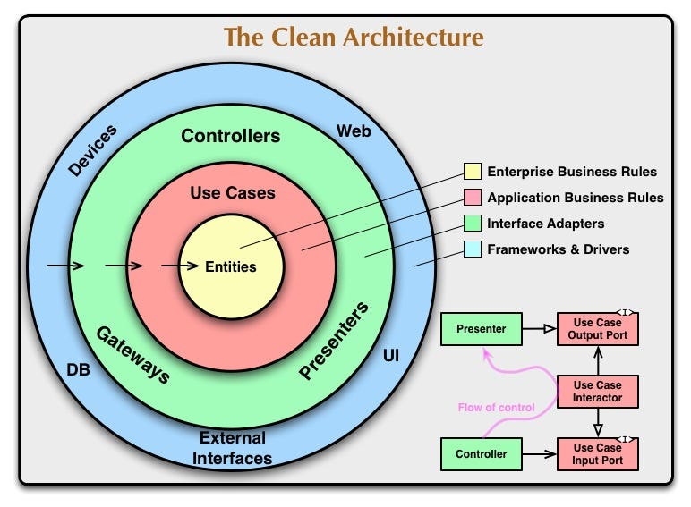
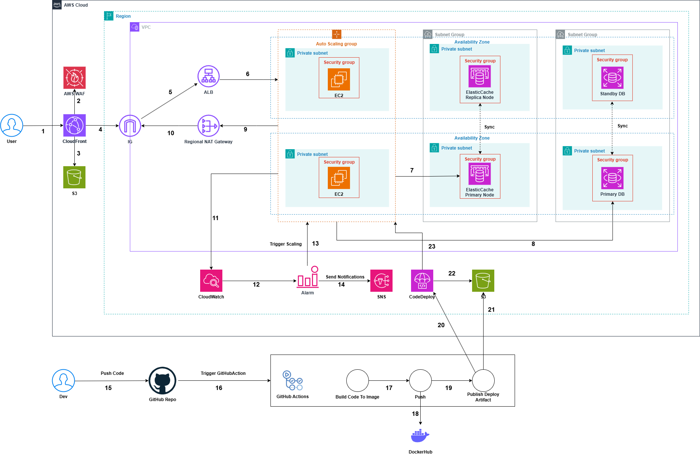

# EngExam — English Learning and Examination Platform

## About the Project

EngExam is an online English learning and examination platform designed to help users improve their English skills through practice tests, mock exams, vocabulary learning, flashcards, and interactive features.

The backend is built with ASP.NET Core Web API and follows Clean Architecture and CQRS to improve separation of concerns, maintainability, and scalability.
## Architecture

### Clean Architecture

The backend follows Clean Architecture principles to maintain separation of concerns, testability, and maintainability.



### AWS Architecture

The application is deployed on AWS using a scalable and highly available cloud architecture.



## Main Features

### 1. Core Features

* Clean Architecture with Domain, Application, Infrastructure, and Web API layers
* ASP.NET Core 9.0 with Entity Framework Core
* CQRS for separating command and query operations
* RESTful APIs for English exam and learning features
* JWT-based authentication and authorization
* ASP.NET Core Identity and Google OAuth authentication
* English practice tests and mock exams
* Exam history and score tracking
* Vocabulary management
* Flashcard learning
* Articles and comments
* User profile management
* Real-Time game

### 2. Vocabulary Learning

* Vocabulary management with word, meaning, phonetic, and part of speech
* Vocabulary flashcards for learning and reviewing words
* Audio pronunciation for vocabulary
* Amazon Polly integration for text-to-speech generation
* Redis caching for frequently accessed vocabulary data

### 3. Real-Time Word Guessing Game

* Implemented real-time communication using SignalR
* Developed an online multiplayer word-guessing battle game
* Used Redis to manage room state and shared game data
* Implemented real-time score and game-state synchronization
* Supported multiple players participating in the same game room

### 4. Performance and Caching

* Implemented Redis caching using the cache-aside pattern
* Cached frequently accessed exam and exam category data
* Reduced unnecessary database queries
* Improved data retrieval performance for frequently accessed resources

### 5. Messaging and Background Processing

* Implemented event-driven messaging using RabbitMQ
* Synchronized data between write and read databases
* Used RabbitMQ to process email-related events
* Integrated SMTP for email services
* Implemented background jobs using Hangfire

### 6. Containerization

* Containerized the application using Docker
* Built and published Docker images to Docker Hub
* Configured the application to run in containerized environments

### 7. AWS Infrastructure and Hosting

Designed and deployed the application using AWS cloud services:

* **EC2**
* **RDS**
* **ElastiCache**
* **S3**
* **CloudFront**
* **WAF**

### 8. CI/CD

Built a CI/CD pipeline using:

* GitHub Actions
* Docker Hub
* AWS CodeDeploy
* Amazon S3

The pipeline automates Docker image building, publishing, and application deployment.


## Technology Stack

### Backend

* C#
* ASP.NET Core Web API
* Entity Framework Core
* ASP.NET Core Identity
* CQRS
* Clean Architecture

### Database and Caching

* SQL Server
* Redis
* Amazon RDS
* Amazon ElastiCache

### Messaging and Real-Time

* RabbitMQ
* MassTransit
* SignalR


### External Services

* Google OAuth
* SMTP
* Amazon Polly
* Hangfire

### Cloud and DevOps

* AWS EC2
* AWS RDS
* AWS ElastiCache
* AWS S3
* AWS CloudFront
* AWS WAF
* Docker
* Docker Hub
* GitHub Actions
* AWS CodeDeploy

## Getting Started

### Prerequisites

* .NET SDK
* Docker
* SQL Server
* Redis
* RabbitMQ

### Installation

Configure the required application settings and connection strings, then build and run the application.

For the containerized environment, build the Docker image and run the required services.

Clone the repository:

```bash
git clone https://github.com/pdtuan04/engexam.git
cd cd engexam
```

Create .env and fill in the required environment variables:
```
DB_SERVER=sqlserver
DB_NAME_WRITE=ENG_WRITE
DB_NAME_READ=ENG_READ
DB_USER=SA
DB_PASS=111AAAa@sql
REDIS_CONNECTION=redis:6379,abortConnect=false,connectTimeout=500,syncTimeout=500
ASPNETCORE_ENVIRONMENT=Production
ASPNETCORE_URLS=http://+:8080
MQ_HOST=amqp://engexam-mq:5672
MQ_USER=...
MQ_PASS=...
JWT_AUDIENCE=https://localhost:7262
JWT_ISSUER=https://localhost:7262
JWT_SECRET=YOUR_SUPER_SECRET_KEY_AT_LEAST_32_CHARS
GOOGLE_CLIENT_ID=your_google_client_id
GOOGLE_CLIENT_SECRET=your_google_client_secret
STORAGE_TYPE=S3
S3_REGION=ap-southeast-1
S3_BUCKET_NAME=your_bucket_name
S3_CLOUDFRONT_DOMAIN=[https://your-cloudfront-id.cloudfront.net](https://your-cloudfront-id.cloudfront.net)
EMAIL_PROVIDER=SMTP
SMTP_HOST=smtp.gmail.com
SMTP_PORT=587
SMTP_USER=your_email@gmail.com
SMTP_PASS=your_app_password
AI_MODEL_TYPE=OpenAI
```

Run
```bash
docker compose up --build -d
```
## License

This project is licensed under the MIT License.

## Contact

For any inquiries or feedback, please contact via email: [pdtuan04@gmail.com](mailto:pdtuan04@gmail.com)